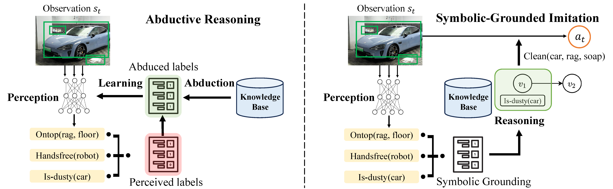

# ABIL: Learning for Long-Horizon Planning via Neuro-Symbolic Abductive Imitation

### [Paper (Coming soon)](https://github.com/Hoar012/ABIL-KDD-2025) | [Project Page](https://www.lamda.nju.edu.cn/shaojj/KDD25_ABIL/)

## News
- **2024.11.17** ABIL is accepted by **KDD 2025**!

## The Framework of Abductive Imitation Learning.

